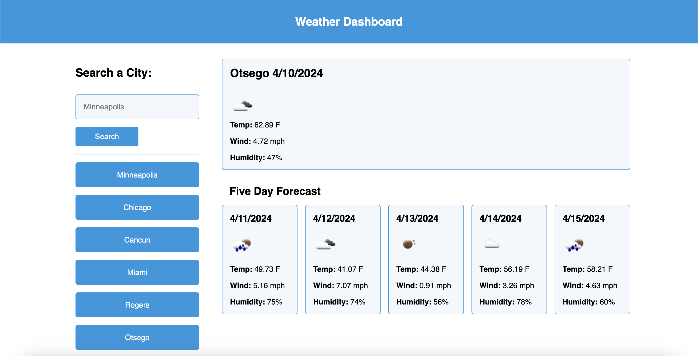

# challenge06-owen-kanzler

## Description

This is challenge 06 of the UMN Bootcamp. Here I fetched two different api's one to get the coordinates for the city that was searched and another to get the weather data using those coordinates. I setup so that it displays the current day and then a five day by looping through the api data and checking to see if the dates have already been rendered. Saving all of the info into local storage so its there when reloaded.

## Assets

## Usage

https://owenkanzler.github.io/challenge06-owen-kanzler/

## License

Please refer to the LICENSE in the repo.
